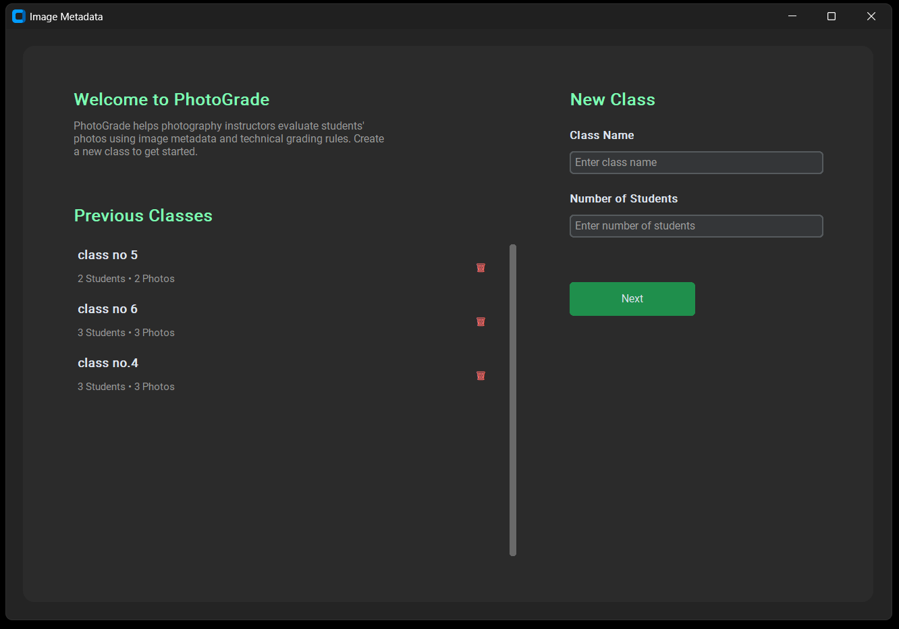
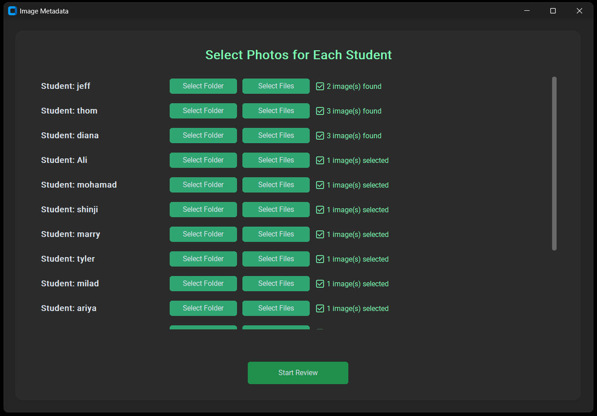
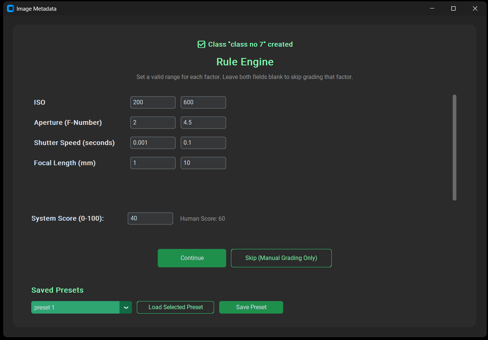
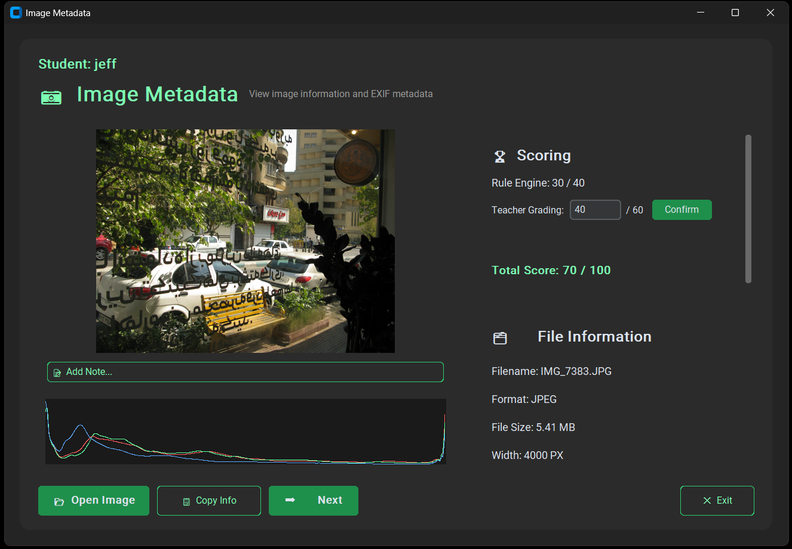

# 📷 PhotoGrade

A modular Python desktop application for **technical photography grading** based on image metadata and configurable photography rules.

PhotoGrade is a **Smart Photography Grading Assistant** for photography teachers. It manages classes of students, analyzes their photographs using EXIF metadata and a configurable Rule Engine, then combines the automated technical score with the teacher's manual evaluation into a final grade.

## ✨ Features

* 🏫 Class Management — create, reopen, and delete persisted classes
* 👨‍🏫 Student-based photography grading workflow
* 📁 Add photos per student via folder or individual file selection
* 🖼️ Multi-image student submissions
* 📷 EXIF metadata extraction
* 📊 RGB histogram analysis
* ⚙️ Configurable Rule Engine with automatic tolerance
* 💾 Rule Engine Presets — save and reuse a rule configuration across classes
* 🟢🟡🔴 Technical evaluation using Green / Yellow / Red results
* 👤 Teacher Grading with configurable System / Human score weighting
* 🧮 Automatic Total Score calculation
* 📝 Per-photo notes
* 📈 Student DataFrame — per-photo score breakdown with pandas
* 🏁 Class Results screen with per-student completion status
* 🖱️ Drag & Drop image loading
* 📋 Copy image and metadata information
* 📦 JSON / CSV export support

## 📸 Screenshots

### Home



### Class Management



### Rule Engine



### Grading



## 🧠 Python Concepts Used

The project applies practical Python development concepts, including:

* Modular project architecture
* Object-Oriented Programming
* Classes and data models
* Lists, dictionaries, and data processing
* File and folder handling
* Exception handling and input validation
* Unit testing with pytest
* GUI development with Tkinter / CustomTkinter
* Image processing with Pillow
* EXIF processing with piexif
* Data analysis with pandas

## 🏗️ Project Structure

```text
Photography-Grading-Assistant/
│
├── app/
│   ├── core/
│   │   ├── class_model.py
│   │   ├── converters.py
│   │   ├── histogram.py
│   │   ├── image.py
│   │   ├── metadata.py
│   │   ├── rules.py
│   │   ├── scoring.py
│   │   ├── student.py
│   │   ├── student_dataframe.py
│   │   ├── teacher_scoring.py
│   │   └── tolerance.py
│   │
│   ├── gui/
│   │   ├── app.py
│   │   ├── class_screen.py
│   │   ├── histogram_panel.py
│   │   ├── home_screen.py
│   │   ├── image_viewer.py
│   │   ├── metadata_panel.py
│   │   ├── results_screen.py
│   │   ├── rule_engine.py
│   │   ├── student_detail.py
│   │   ├── student_setup.py
│   │   ├── teacher_grading.py
│   │   └── widgets.py
│   │
│   └── storage/
│       ├── class_storage.py
│       ├── export.py
│       └── rule_presets.py
│
├── assets/
│   └── images/
│
├── classes/
├── tests/
├── main.py
├── requirements.txt
├── rule_presets.json
└── README.md
```

The application is separated into three main layers:

* **`app/core/`** — image processing, metadata, rules, scoring, class/student data models, and DataFrame analysis
* **`app/gui/`** — graphical interface and application workflow
* **`app/storage/`** — persistence (classes, rule presets) and export functionality

This separation keeps the core logic independent from the GUI and makes the project easier to test and extend.

## ▶️ Run

Install dependencies:

```bash
pip install -r requirements.txt
```

Run the application:

```bash
python main.py
```

## 🧪 Tests

Run the test suite:

```bash
python -m pytest tests/ -v
```

## 🚀 Vision

PhotoGrade is gradually evolving toward a **local-first, privacy-friendly photography grading system** where teachers can manage classes, define technical requirements, automatically evaluate student photographs, and combine the results with their own assessment.

The long-term goal is to extend the system with more advanced student-level statistics, richer grading reports, and optional AI-assisted photography evaluation.